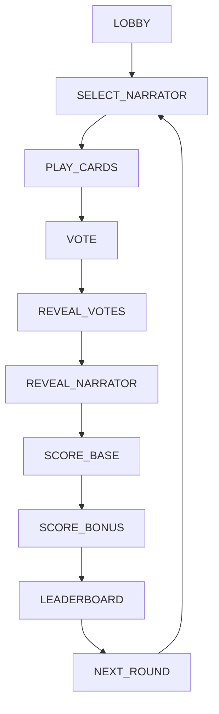

# Dixit Score Companion

Mobile-first web companion for a **physical Dixit** table: shared scores, host-driven phases, and real-time state on every phone. The deck and story stay in the real world; this app only tracks **numbers, phase, and votes**.

> **Reference docs:** for protocol details, field-by-field data shapes, and exact API behaviour, see [`docs/`](docs/) (especially [`API_SPECS.md`](docs/API_SPECS.md), [`DATA_MODEL.md`](docs/DATA_MODEL.md), [`CURRENT_STATE.md`](docs/CURRENT_STATE.md)).

---

## 1. Project overview

| | |
|---|--|
| **What it is** | A small FastAPI + vanilla JS app: players join a room, the **host** advances rounds, the server enforces rules and broadcasts updates over WebSocket. |
| **Feel** | **Kahoot-like**: one shared session, one screen for “what to do now”, the host unlocks the next step—without the party-game noise. |
| **Scope** | Scorekeeping and phase state only—not digital cards, not a replacement for Dixit. |

**Core principles**

- **No login** — identity is a server-issued `player_id` plus a `recovery_token` stored in the browser to reconnect.
- **Session-based multiplayer** — each `game_id` is an isolated in-memory room; no database.
- **Host-controlled flow** — phases do not auto-advance; the first joiner is the **host** and drives `next_phase` (with one narrator-only confirmation step in `SELECT_NARRATOR`).
- **Real-time interaction** — every important mutation ends in a **sanitized** `game` object pushed to all connected clients.

---

## 2. Game flow

**Server phases** (authoritative) follow a fixed loop. **Vote preview** is a **client UI state** during `VOTE` (confirm/edit before the server list is final for the host’s advance—see [GAME_FLOW](docs/GAME_FLOW.md)).



**Narration (text)** — same path with labels:

1. **Lobby** — join with nickname; host starts (≥3 players).  
2. **Select narrator** — host picks storyteller; narrator **confirms**; host continues to play.  
3. **Play cards** — each player submits a **unique** card number (1–84).  
4. **Vote** — non-narrators cast 1 or 2 votes (config). **Vote preview** (client only): confirm or change before host advances.  
5. **Reveal votes** — who voted which card(s) (narrator’s own card not shown as a “guess” here).  
6. **Reveal narrator** — generic “continue” step; table reveals the true card.  
7. **Scoring** — **base** then **bonus** in two host steps; UI shows per-round `+Δ` from server fields.  
8. **Leaderboard** — cumulative scores.  
9. **Next round** — server resets round data; back to **select narrator**.

---

## 3. Architecture

| Layer | Role |
|-------|------|
| **Frontend** | `frontend/index.html` + `frontend/app.js`: renders from `state.game` only; uses REST for actions, WebSocket for live updates. |
| **Backend** | FastAPI: REST routes + one WS endpoint per game; **no** business logic in routes beyond validation and broadcast. |
| **Real-time** | After mutations, the server broadcasts JSON `{ event, game }` where `game` is a **wire projection** (strips secrets, adds `available_actions` + `card_range`). |

**Separation of concerns**

- **`backend/services/game_service.py`** — only place that **mutates** `Game` / `Player`; phase changes go through the state machine; scoring invoked on entering `SCORE_BASE` / `SCORE_BONUS`.  
- **`backend/rules/`** — **scoring and ruleset point values** (JSON per ruleset + Python engines).  
- **`backend/store.py`** — single in-memory `dict[game_id, Game]`.  
- **Frontend** — never computes scores or phase rules; it enables buttons based on `available_actions` from the server.

**State** — in-memory, single process; **restart = all games lost** (by design for LAN sessions).

**ASCII overview**

```text
  ┌─────────────┐   REST     ┌──────────────┐   WebSocket
  │   Browser   │──────────▶│   FastAPI    │◀──────── room broadcast
  │  (app.js)   │◀──────────│  game_service│
  └─────────────┘   JSON     │  + rules/    │
                    game      │  + store     │
                              └──────────────┘
```

---

## 4. Data model

**Wire payload** also includes `available_actions` and `card_range` (injected; not on the Pydantic `Game` model). See [`DATA_MODEL.md`](docs/DATA_MODEL.md).

### Game

| Field | Description |
|-------|-------------|
| `id` | Short hex game id. |
| `phase` | Current `GamePhase` string. |
| `players` | Ordered list of players. |
| `host_id` | First joiner; host-only `next_phase` / `select_narrator`. |
| `narrator_id` / `narrator_confirmed` | Storyteller pick + confirmation before `PLAY_CARDS`. |
| `cards_on_table` | Submitted card numbers (round). |
| `ruleset` | e.g. `standard`, `high_risk`, `casual`. |
| `votes_per_player` | 1 or 2 (set at `create_game`). |
| `score_base_applied` / `score_bonus_applied` | Idempotency for scoring steps. |
| `last_base_delta` / `last_bonus_delta` | Per-player `player_id →` points for the last base/bonus application (for UI). |

### Player

| Field | Description |
|-------|-------------|
| `id` / `nickname` | Identity and display name. |
| `score` | Cumulative total. |
| `card_played` | This round’s card; cleared on round reset. |
| `votes` | This round’s **list of voted card numbers** (length ≤ `votes_per_player`; narrator has none). |
| `connected` / `last_seen` / `recovery_token` | Liveness and reconnect (token stripped on wire to others). |

### Vote (conceptual; no separate table in code)

There is **no** `Vote` record type. Votes are **embedded on each** `Player` as `votes: list[int]`; validation (phase, cap, no own card, no duplicate card in list, only cards on the table) lives in `game_service`. The **narrator** does not vote.

---

## 5. Game rules system

- **Base mode (`standard`)** — classic Dixit-style **base** scoring (all/none/some correct on narrator’s card) and **bonus** from votes on **non-narrator** players’ cards; narrator gets **no** vote-based bonus. Point numbers live in `backend/rules/config/standard.json` and are applied in `SCORE_BASE` / `SCORE_BONUS` via `StandardDixitRules` (inherited by other engines).
- **Other rulesets** — `high_risk` and `casual` use the same engine shape with different JSON; registered in `rules_loader` (`GET /rulesets` for names).
- **Scoring structure** — two **server phases** (`SCORE_BASE`, `SCORE_BONUS`) with idempotent flags; the UI uses **phase** + `last_base_delta` / `last_bonus_delta` for the two panels.
- **Vote logic** — `submit_vote` appends; `update_vote` replaces the list; `votes_per_player` is fixed for the life of the game. Host advance from `VOTE` requires all **active** non-narrators to have ≥1 vote.
- **Odyssey (placeholder)** — *Dixit Odyssey* and similar variants often imply different vote counts or table rules. The codebase already allows **1–2 votes per player** and a **pluggable ruleset registry**; a future “Odyssey” would likely be a **new ruleset name** + config module + JSON, without changing the high-level “rules engine + `game_service`” split. **No Odyssey rules are implemented**—this is only architectural readiness.

---

## 6. Deployment

**Local (Python)**

1. `python3 -m venv .venv`  
2. `source .venv/bin/activate` (or `.venv\Scripts\activate` on Windows)  
3. `pip install -r requirements.txt`  
4. `uvicorn backend.main:app --host 0.0.0.0 --port 8000 --reload`  
5. Open `http://localhost:8000` on player devices (same LAN for real use).

**Docker (present in repo)**

1. `docker build -t dixit-score-companion .`  
2. `docker run --rm -p 8000:8000 dixit-score-companion`  
3. Exposes `uvicorn` on `8000` (see [`Dockerfile`](Dockerfile)).

**Production / internet**

- Any host that can run a **single long-lived** Python (or container) process with **HTTP + WebSocket** (e.g. small VPS, PaaS). CORS is currently `*` in code—suitable for LAN; **tighten for public internet**.

**NAS / home server (future)**

- Same Docker image: run on a NAS or home machine, open one port, share `http://<ip>:8000` on Wi‑Fi. No cloud dependency in the app itself.

---

## 7. Real-time communication

- **Sync** — clients keep `game_id`, `player_id`, and `recovery_token`; they open `GET /ws/{game_id}` and replace local state with every `{ event, game }` that includes `game`.  
- **Host** — `POST /next_phase`, `POST /start_game`, `POST /select_narrator` (narrator uses `POST /confirm_narrator` where required); `available_actions` tells the UI if `next_phase` is legal.  
- **Propagation** — REST and WS handlers call `game_service`, then `notify_game_room` so **every** socket in the room gets the same `game` snapshot (except per-socket errors / `pong` without `game`).

---

## 8. Future extensions (architecture only; not implemented)

| Area | Readiness |
|------|-----------|
| **Odyssey-style or higher vote caps** | `votes_per_player` and list-based `Player.votes`; extending caps would be service validation + config, not a new store. |
| **More rulesets** | Add engine class + JSON + register in `rules_loader` (see comments in that file). |
| **UI** | Phase-specific screens can grow; server contract stays `game` + `available_actions` + `card_range`. |

---

## 9. Tech stack

| Area | Technology |
|------|------------|
| **Frontend** | HTML, CSS, **vanilla JavaScript** (IIFE, no framework). |
| **Backend** | **Python 3.12+** (3.9+ for local), **FastAPI**, **Pydantic v2**, **Uvicorn**. |
| **Real-time** | **WebSockets** (Starlette/FastAPI), `websockets` dependency. |
| **Ops** | **Docker** (optional), `requirements.txt` for pip. |

---

## Licence / project

See the repository for licence (if any). This README is generative documentation only; for behaviour guarantees, test against the code and `docs/`.
